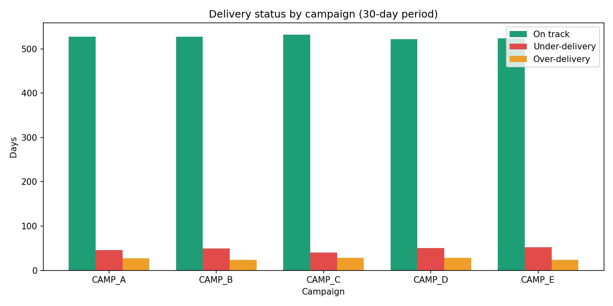
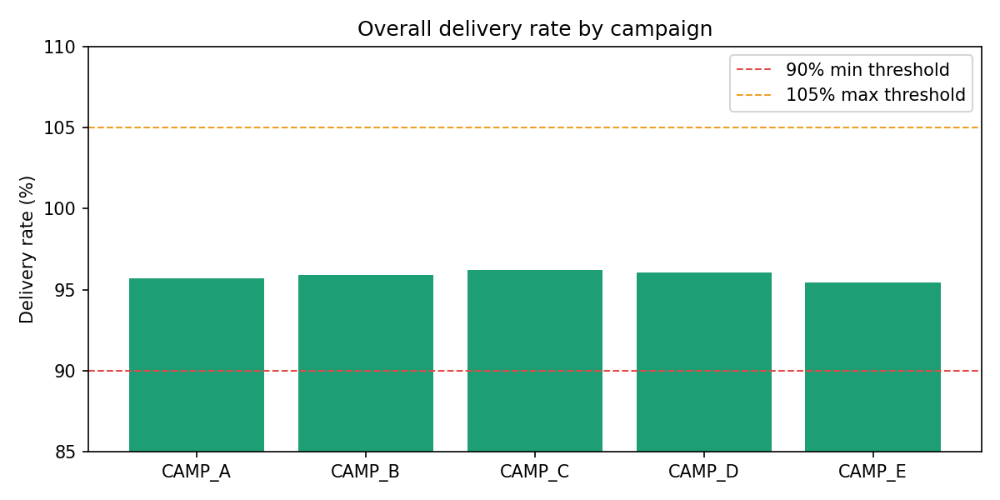
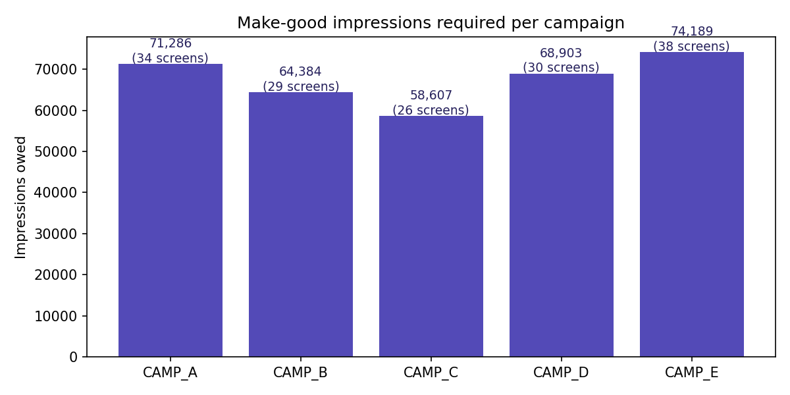

# Impression Delivery Audit Engine

## Problem

DOOH campaigns run on guaranteed impression contracts. When a brand books
a campaign, the operator is contractually obligated to deliver a specific
number of impressions across their screen network.

In practice, delivery fails silently — screens go offline, scheduling
errors occur, or campaigns run inconsistently. Most operators track this
manually in spreadsheets, often only checking at campaign end when it is
too late to fix.

This tool automates daily delivery auditing across a screen network,
flags problem campaigns early, and generates a make-good schedule showing
exactly how many impressions are owed per campaign.

## What it does

- Ingests daily play log data (screen, campaign, booked vs. delivered)
- Calculates delivery rate per campaign per day
- Flags under-delivery (below 90%) and over-delivery (above 105%)
- Calculates impression deficit for every flagged campaign
- Outputs a make-good schedule by campaign

## Industry context

Relevant to operators running impression-guaranteed digital OOH campaigns,
including JCDecaux, Ocean Outdoor, and Clear Channel (UK) and Ströer and
Goldbach (Germany). Delivery tolerance thresholds (90%–105%) reflect
standard DOOH industry practice.

## How to run
python generate_data.py
python audit.py
python charts.py
## Results

### Delivery status by campaign (30-day period)

### Overall delivery rate by campaign

### Make-good impressions required

## Key findings

Across 3,000 campaign-screen-days audited over a 30-day period:

- 87.7% of days were on track, 7.9% were under-delivered, 4.4% were
  over-delivered
- CAMP_E had the worst delivery performance — lowest overall rate (95.43%)
  and the highest make-good liability (74,189 impressions across 38 screens)
- CAMP_C performed best with a 96.22% delivery rate and fewest
  under-delivery days (40)
- Total make-good impressions owed across all campaigns: **337,369**
  — representing significant revenue exposure for the operator

## Tools

Python · Pandas · Matplotlib